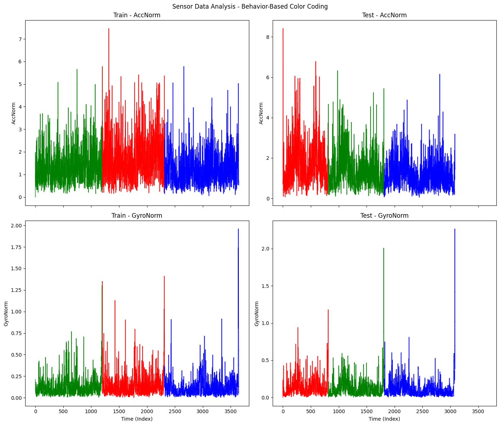
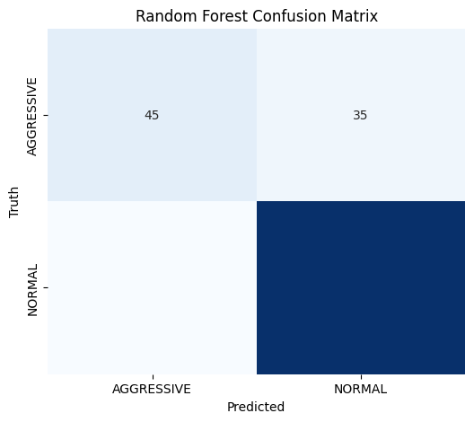
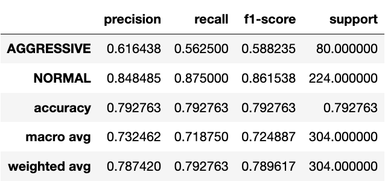
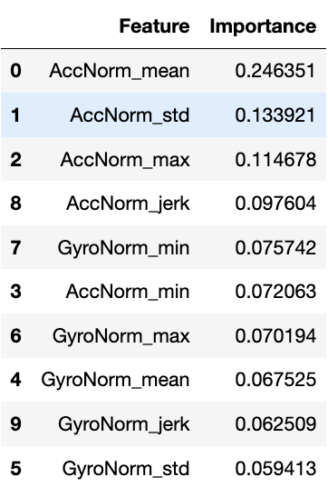
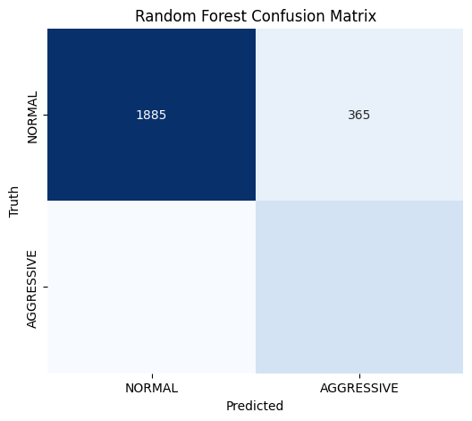
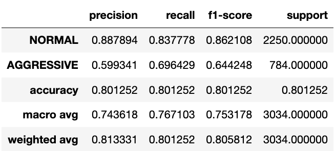

# Detecting Aggressive Driving Behavior from Smartphone Motion Data
## Introduction
Car accidents are often caused by aggressive driving behavior. Recognizing and mitigating aggressive driving is an important task for road safety. Although it is somewhat subjective to determine what counts as "aggressive," there are certain patterns one would expect from an aggressive driver, including rapid acceleration and deceleration (stomping on the gas and slamming on the brakes), sharp turns, constant readjustments, and turns at high speeds. These behaviors should be detectable in data collected from smartphone accelerometers and gyroscopes. Thus, the goal of this project is to develop a model that can accurately classify aggressive driving behavior, based on smartphone sensor readings.
## Data
The dataset used in this project is the Driving Behavior Dataset from [Kaggle](https://www.kaggle.com/datasets/outofskills/driving-behavior), which consists of time-series data collected at two observations per second. Each observation contains directional accelerometer readings (AccX, AccY, and AccZ), which measure forward/backward acceleration; and directional gyroscope readings (GyroX, GyroY, and GyroZ), which measure rotational velocity. Each observation takes place during one of three trials (NORMAL, SLOW, and AGGRESSIVE) associated with different types of driving behavior, and is labelled accordingly.

The data is saved in two datasets– one for training, one for testing. The train-test split is about 55/45.
## Task
The goal of this project is to classify aggressive vs. non-aggressive driving behavior using accelerometer and gyroscope measurements. 

Notably, this task groups together NORMAL and SLOW driving behavior, making this a binary classification between AGGRESSIVE and (NORMAL or SLOW), a much easier (and realistically, more practical) task than discriminating between all three.

Additionally, since driving behavior can most likely not be determined within a 0.5-second timeframe, classification will take place on a 10-second window– that is, the tool will aim to determine whether or not a 10-second recording indicates aggressive driving.

## Expected Challenges
The main challenge involved in this task is due to label overlap. The dataset assumes that every observation within a trial belongs to the same label (NORMAL, SLOW, or AGGRESSIVE). However, in reality, during any given trial, there may have been times where the driver was not exhibiting the intended behavior. For example, there are probably several 10-second windows from the AGGRESSIVE trials where the driver’s behavior would be better described as “normal,” but this prediction would be wrong according to the dataset. Thus, the model will have to learn despite a lot of noise.

Additionally, a major component of aggressive driving is speeding. However, this dataset does not have any information on velocity– while acceleration measurements could be integrated to calculate velocity, I cannot be certain that these calculations would be accurate, and there is no information on initial velocity. Even if velocity data were available, there is no information about speed limits to determine whether the driver is speeding. As such, there may be many moments where aggressive driving is taking place, but it would not be reflected in the data.
## Preprocessing
Since directional acceleration and gyroscope measurements are probably not very useful on their own, the norms (magnitudes) were calculated and stored as AccNorm and GyroNorm, respectively. Using these data, the overall motion of the phone (and the car) can be visualized:

The differences are not drastic, but in general, there seem to be higher, more frequent, spikes in the AGGRESSIVE trials than the NORMAL trials (and so on for NORMAL > SLOW).

Importantly, at the end of each trial, there is a noticeable spike, particularly in the GyroNorm signal. Since these recordings were taken from a phone application, this effect is probably an artifact caused by the driver picking up their phone to stop the recording. Therefore, to avoid misleading data, the last 5 seconds were trimmed off for each trial.

After this, the NORMAL and SLOW labels were merged to all be labeled NORMAL.
## Model Training
### Random Forest
I first trained a Random Forest model using the engineered features, as it is a quick, interpretable model to start with. Additionally, the feature importance rankings would be useful. And if the model proves to be successful, there might be a simple threshold function (e.g. a max acceleration value) that could be used to detect aggressive behavior.

#### Feature Engineering
I transformed the data into 10-second windows that move with a 5-second stride (half-overlapping). For each window, I computed summary statistics of acceleration and rotational velocity:
- Mean: AGGRESSIVE windows should have a higher mean acceleration and rotational velocity than NORMAL windows
- Standard Deviation: AGGRESSIVE windows should have more varied acceleration and rotational velocity measurements than NORMAL windows
- Maximum and Minimum: AGGRESSIVE windows should have a higher maximum acceleration and rotational velocity than NORMAL windows; NORMAL windows should have a lower minimum.
I also computed jerk (delta acceleration) and rotational acceleration (delta rotational velocity) to highlight sudden movements and turns. 

Because there are about twice as many samples for NORMAL driving than AGGRESSIVE driving (after combining NORMAL and SLOW), I ensured that the model would balance classes.
#### Results:

Overall, the model had a surprisingly high accuracy (###). It performed well for NORMAL driving [][][], but poorly for AGGRESSIVE driving [][][]. Given the overlap challenge described earlier, this would be expected of any model. However, it is not clear if the model’s poor performance is entirely due to this inherent challenge, or if it is simply a bad model.

The most important features were acceleration mean and acceleration standard deviation. Gyroscope measurements were least important– this is possibly because 1) some phone-rotation movements may have been independent of the car, not reflecting the driving behavior and 2) rotational information may correlate with acceleration, making it redundant. Interestingly, jerk and rotational acceleration were not particularly important, likely because they were not calculated as instantaneous measurements.
### LSTM
Since driving behavior follows a time-dependent pattern, I trained a Long Short-Term Memory (LSTM) network, a much more sophisticated model for sequential data. This model can capture time-based dependencies better than a feature-based model, and unlike the previous Random Forest model, which required static summary statistics, LSTMs instead use the raw time-series signal.

#### Preprocessing
Since using the magnitudes of acceleration and rotation condensed the information, it is possible that some important information was lost when training the Random Forest model. Because of this, the LSTM’s training included all directional acceleration and gyroscope data. Sequences of 10 seconds (20 time-steps) were fed into the model. The LSTM was trained with two stacked layers, dropout regularization to avoid overfitting, and a final sigmoid activation for binary classification.
#### Results:

Surprisingly, performance was rather similar to that of the Random Forest model [accuracy###]. The LSTM had higher precision and recall for both NORMAL (###, ###) and AGGRESSIVE (###, ###) driving, but still struggled to classify AGGRESSIVE driving correctly. While the model could be refined to have improved results, I suspect that it is simply facing the same challenge that the Random Forest faced (an issue with class overlap) and efforts to improve performance – without overfitting – would have diminishing returns.
## Conclusion
This project explored the feasibility of detecting aggressive driving using smartphone motion sensors. Both Random Forest and LSTM models successfully identified NORMAL behavior but struggled with AGGRESSIVE behavior due to label overlap. A critical issue introduced by this project is determining a reasonable window size – short windows (<2 sec) lack context, while long windows (>5 min) are impractical. Surprisingly, jerk and rotational acceleration were not important features, likely because they were 1) computed from norms rather than directional vectors and 2) averaged over windows rather than calculated instantaneously. With additional data, including velocity or even sound (e.g., engine or skid noises), model performance could likely improve significantly.
